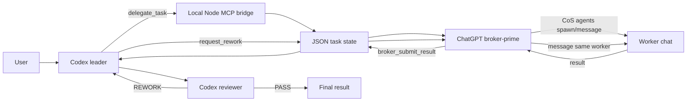

# Codex Luna Orchestrator

A lightweight local-first multi-agent coding workflow where **Codex leads and reviews** while **Chat On Steroids workers implement bounded tasks** through a small MCP bridge.

> Experimental community project. It is not an official OpenAI or Chat On Steroids project.

No Redis, Docker, database, vector store, Mastra, or external orchestration framework is required.

## Why this exists

The goal is to keep high-value reasoning in Codex while delegating routine implementation work to reusable worker chats. Codex remains responsible for architecture, task decomposition, file scope, acceptance criteria, review decisions, and the final user response.

Workers receive small implementation tasks and cannot broaden their own file scope through the bridge.

## Architecture



The broker-prime is intentionally thin. Chat On Steroids worker ownership depends on a real ChatGPT conversation identity, so the broker-prime only transports tasks and results. Codex still owns the engineering decisions.

## Requirements

- Node.js 20+
- npm
- Codex CLI or Desktop with project-scoped `.codex/config.toml` support
- Chat On Steroids with Core connected
- Chat On Steroids multi-agent mode enabled
- a worker model configured in Chat On Steroids defaults

The project is currently tested on Node.js 24. The package declares Node.js 20+ as its supported runtime floor.

## Quick start

From the repository root:

```bash
npm ci
npm run check
npm run doctor
```

`npm run check` runs TypeScript validation and builds `dist/server.js`.

`npm run doctor` performs read-only environment checks. It is safe to run before the broker starts; an offline broker is reported as a warning rather than a failure.

### 1. Start Codex from the repository root

The project-scoped `.codex/config.toml` starts `node dist/server.js`.

The process exposes two MCP surfaces:

- Codex-facing stdio tools
- a loopback broker endpoint at `http://127.0.0.1:8788/mcp`

The broker health endpoint is `http://127.0.0.1:8788/health`.

### 2. Add the broker to Chat On Steroids

Create a custom remote MCP plugin:

```text
Name: Codex Luna Broker
URL:  http://127.0.0.1:8788/mcp
```

It should expose:

- `broker_next_task`
- `broker_start_task`
- `broker_submit_result`
- `broker_fail_task`

Keep Chat On Steroids Core connected and multi-agent mode enabled.

### 3. Open the broker-prime chat

Open one dedicated ChatGPT conversation with both Chat On Steroids Core and the local broker plugin available. Paste the instructions from [`BROKER_PRIME.md`](./BROKER_PRIME.md) into that conversation.

The broker-prime must not implement tasks itself.

### 4. Use Codex normally

Example prompt:

```text
Create a small local log analyzer under demo-log-analyzer/.
Use the Codex-Luna orchestration workflow.
Keep Codex as leader and reviewer and delegate implementation to workers.
```

Codex can then create bounded tasks such as:

```json
{
  "task_id": "LOG-PARSER-001",
  "role": "developer",
  "task": "Implement the log parser described by the leader.",
  "allowed_files": ["demo-log-analyzer/parser/**"],
  "acceptance_criteria": [
    "Parses the required fields",
    "Does not change files outside the delegated scope"
  ]
}
```

## Codex-facing tools

The stdio MCP server exposes:

- `delegate_task` — queue one bounded implementation task
- `get_task_status` — inspect task state
- `get_task_result` — read a completed result
- `request_rework` — send reviewer findings back to the same worker flow

## Broker-facing tools

The loopback MCP server exposes only coordination operations:

- `broker_next_task`
- `broker_start_task`
- `broker_submit_result`
- `broker_fail_task`

It intentionally does not expose shell execution.

## Review and rework

The configured Codex reviewer is read-only and returns either `PASS` or `REWORK` with actionable findings.

On rework, the task keeps its saved `worker_id`. The broker uses `agents action=message` so the same worker conversation can continue with its existing context when it is still revivable.

The default maximum is two rework rounds. The reviewer configuration intentionally does **not** hard-code a specific Codex model, making the repository easier to use across different accounts and environments.

## Configuration

Defaults work without any environment variables.

| Variable | Default | Purpose |
| --- | --- | --- |
| `TASK_STATE_PATH` | `.runtime/tasks.json` | Local task state |
| `MAX_REWORK_ROUNDS` | `2` | Maximum reviewer rework rounds |
| `LUNA_BROKER_PORT` | `8788` | Loopback broker MCP port |
| `LUNA_BROKER_PATH` | `/mcp` | Broker MCP path |

The application reads environment variables directly. It does **not** automatically load `.env` files.

PowerShell example:

```powershell
$env:LUNA_BROKER_PORT = "8790"
```

Bash/zsh example:

```bash
export LUNA_BROKER_PORT=8790
```

If the broker port or MCP path changes, update the Chat On Steroids remote plugin URL too.

## Local state

Task state is stored in `.runtime/tasks.json` and ignored by Git.

Do not copy it to another machine or broker-prime conversation expecting worker continuity. Persisted `worker_id` values belong to the original ChatGPT / Chat On Steroids worker history.

For the current prototype, avoid restarting the bridge while tasks are actively running. A running worker is not automatically reconstructed after a process restart.

## Portability

For a new machine or clean environment:

```text
clone/copy repository
  -> npm ci
  -> npm run check
  -> start Codex from repository root
  -> register the local broker in Chat On Steroids
  -> enable Core + multi-agent
  -> open a fresh broker-prime chat
  -> run a small smoke task
```

Do not copy `node_modules` across operating systems. Reinstall dependencies with `npm ci`.

See [`PORTABILITY_REPORT.md`](./PORTABILITY_REPORT.md) for more detail.

## Troubleshooting

### `PLUGIN_DISABLED` or `conflicted`

Refresh or reconnect the relevant Chat On Steroids connector. If a worker already exists and is revivable, wake the same worker instead of spawning a duplicate.

### Broker plugin is not ready

Make sure Codex has already started the bridge, then check `http://127.0.0.1:8788/health`.

If another application owns port `8788`, choose another `LUNA_BROKER_PORT` and update the Chat On Steroids plugin URL.

### `dist/server.js` is missing

Run `npm run build`.

### `.env` changes do nothing

That is expected. `.env` is only an example file; export environment variables in the shell or launcher that starts Codex/Node.

### Worker task is rejected for being too large

Split the implementation into smaller bounded tasks. Worker prompts are deliberately capped to stay within the Chat On Steroids worker task limit.

## Security model

- broker HTTP binds only to `127.0.0.1`
- non-loopback Host headers are rejected
- task file paths must be relative
- path traversal is rejected
- returned `files_changed` paths are checked against `allowed_files`
- workers should not receive secrets in task text
- results are reviewed before final acceptance

See [`SECURITY.md`](./SECURITY.md).

## Project layout

```text
src/
  server.ts       Codex-facing stdio MCP
  broker.ts       Loopback broker MCP
  tasks.ts        JSON task state and scope validation
  types.ts        Shared task/result types
  config.ts       Runtime configuration

.codex/
  config.toml
  agents/
    reviewer.toml

plugins/
  codex-luna-orchestrator/

AGENTS.md
BROKER_PRIME.md
PORTABILITY_REPORT.md
SECURITY.md
CONTRIBUTING.md
doctor.mjs
```

## Development

Run directly from TypeScript:

```bash
npm run dev
```

Validate and build:

```bash
npm run check
```

Run the compiled server manually:

```bash
npm start
```

Diagnostic logs go to stderr so the stdio MCP protocol can keep stdout clean.

## Contributing

See [`CONTRIBUTING.md`](./CONTRIBUTING.md). Keep changes small, local-first, and easy to audit.

## License

MIT. See [`LICENSE`](./LICENSE).
