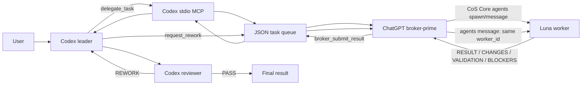

# Codex Luna Bridge

Local-first orchestration prototype where **Codex is the leader and reviewer**, while **Chat On Steroids opens/reuses Luna worker chats** for bounded implementation work.

No Mastra, Redis, Docker, vector database, or external orchestration framework is used. Task state is a local JSON file.

## Architecture



The extra broker-prime exists for one reason: Chat On Steroids Core `agents` requires a **proven ChatGPT conversation identity**. A normal Codex MCP client cannot currently provide that browser/conversation attribution reliably. The broker-prime is therefore transport only; it does not own architecture or implement code.

## What runs where

### Codex side

The project-scoped `.codex/config.toml` starts `node dist/server.js` over stdio and exposes:

- `delegate_task`
- `get_task_status`
- `get_task_result`
- `request_rework`

Codex owns task decomposition, architecture, allowed file scope, review decisions, and the final user response.

### Broker-prime side

The same Node process also exposes a loopback-only Streamable HTTP MCP endpoint:

```text
http://127.0.0.1:8788/mcp
```

It exposes only coordination tools:

- `broker_next_task`
- `broker_start_task`
- `broker_submit_result`
- `broker_fail_task`

Connect this endpoint as a custom remote MCP plugin in Chat On Steroids and use one dedicated ChatGPT conversation with the prompt in [`BROKER_PRIME.md`](./BROKER_PRIME.md).

### Luna worker side

The broker-prime dispatches the returned `worker_prompt` through Chat On Steroids Core `agents`:

- first execution: `action=spawn`
- reviewer rework: `action=message` to the saved `worker_id`

Do not override worker model/reasoning unless intentionally needed. Chat On Steroids applies its saved worker defaults; configure those defaults to Luna for this workflow.

## Project layout

```text
src/
  server.ts       Codex-facing stdio MCP tools
  broker.ts       Loopback broker-prime MCP tools
  tasks.ts        JSON task state + scope validation
  types.ts        Shared task/result types
  config.ts       Local configuration
.codex/
  config.toml
  agents/reviewer.toml
plugins/
  codex-luna-orchestrator/
BROKER_PRIME.md
AGENTS.md
.env.example
```

Runtime state defaults to `.runtime/tasks.json` and is ignored by Git.

## Requirements

- Node.js 20+
- npm
- Codex with project-scoped `.codex/config.toml` support
- Chat On Steroids with Core connected
- Chat On Steroids multi-agent mode enabled
- Chat On Steroids worker defaults configured to the desired Luna model

## Install and verify

```bash
npm install
npm run typecheck
npm run build
```

Development:

```bash
npm run dev
```

Built server:

```bash
npm start
```

The stdio MCP protocol uses stdout; diagnostic logs use stderr. The broker HTTP listener binds only to `127.0.0.1` and rejects non-loopback Host headers.

## Configuration

The process reads environment variables directly; `.env` is not auto-loaded.

| Variable | Default | Purpose |
| --- | --- | --- |
| `TASK_STATE_PATH` | `.runtime/tasks.json` | Persistent task queue/state |
| `MAX_REWORK_ROUNDS` | `2` | Maximum reviewer rework rounds |
| `LUNA_BROKER_PORT` | `8788` | Loopback broker MCP port |
| `LUNA_BROKER_PATH` | `/mcp` | Broker MCP path |

There are no `COS_BASE_URL` or `COS_TOKEN` placeholders anymore. The integration uses Chat On Steroids' supported Core `agents` flow instead of guessing a private worker endpoint.

## Codex task lifecycle

`delegate_task` validates the task and stores it as `queued`:

```json
{
  "task_id": "HELLO-001",
  "role": "developer",
  "task": "Create hello.txt containing Hello Luna",
  "allowed_files": ["hello.txt"],
  "acceptance_criteria": [
    "hello.txt contains exactly Hello Luna",
    "No unrelated files changed"
  ]
}
```

The broker-prime obtains it with `broker_next_task`. For a new task the returned mode is `spawn`; after Chat On Steroids accepts the worker, the broker records the actual `worker_id` with `broker_start_task` and the state becomes `running`.

When the worker reports, the broker calls `broker_submit_result`:

```json
{
  "task_id": "HELLO-001",
  "summary": "Created hello.txt.",
  "files_changed": ["hello.txt"],
  "tests": ["Verified exact file contents"],
  "issues": []
}
```

`files_changed` is checked against `allowed_files` before the task is accepted as `done`. A scope violation is rejected instead of being converted into fake success.

## Reviewer and rework

`.codex/agents/reviewer.toml` defines the independent read-only reviewer. The intended verdict is `PASS` or `REWORK`.

On `REWORK`, Codex calls `request_rework`. The task returns to `queued` with the findings and keeps its previous `worker_id`. The broker then returns:

```text
mode = message
worker_id = previous worker
```

so Chat On Steroids can wake the same worker conversation with `agents action=message`, preserving what that worker already learned.

The default hard limit is two rework rounds.

## Chat On Steroids setup

1. Build this project and launch Codex from the project root so `codex_luna_bridge` is running.
2. In Chat On Steroids, add a custom **remote MCP** plugin with URL:

   ```text
   http://127.0.0.1:8788/mcp
   ```

   Loopback HTTP is explicitly supported by Chat On Steroids for remote plugins; no token is needed for this local endpoint.
3. Enable the plugin tools.
4. Keep Chat On Steroids Core connected with multi-agent mode enabled.
5. Open a dedicated ChatGPT conversation and paste the instructions from `BROKER_PRIME.md`.
6. Configure Chat On Steroids' saved worker default to Luna. The broker prompt intentionally does not hard-code a model slug.

## Verification already performed

The bridge has been tested with the MCP SDK on both surfaces:

```text
Codex delegate_task
  -> queued
broker_next_task
  -> mode=spawn
broker_start_task(worker-1)
  -> running
broker_submit_result
  -> done
Codex request_rework
  -> queued
broker_next_task
  -> mode=message, worker_id=worker-1
```

`npm run typecheck` and `npm run build` pass.

A real Chat On Steroids multi-agent smoke test was also performed. The prime successfully created `worker-1`, and the worker became reusable/sleeping after reporting back. The worker did **not** fabricate success: its repository operation was blocked because its Chat On Steroids connector was currently reported as `PLUGIN_DISABLED / conflicted`, so it returned that exact blocker and changed no files. This confirms the real `agents` spawn/report path while also keeping the remaining connector-health issue explicit.

The persisted Chat On Steroids plugin state now also contains an enabled `Codex Luna Broker` remote MCP entry for `http://127.0.0.1:8788/mcp`. Because Chat On Steroids loads installed plugin records at application startup, restart/refresh Chat On Steroids after the Codex bridge is running before expecting the newly persisted plugin to appear as ready.

## Safety and scope boundaries

- Codex owns architecture; Luna receives bounded implementation instructions.
- The broker-prime coordinates only and should not implement the task itself.
- `allowed_files` must be relative, bounded repository paths/globs.
- Returned `files_changed` is validated before completion.
- The broker MCP does not expose shell execution.
- No secret/token should be placed in task text or reviewer findings.
- A failed worker open/resume must use `broker_fail_task`; never synthesize a Luna result.

## Current platform limitation

Direct `Codex -> Chat On Steroids Core agents` is intentionally not used because CoS worker ownership depends on exact ChatGPT conversation/request attribution. The broker-prime design keeps the worker call on the supported ChatGPT/CoS path while leaving leadership and review in Codex.

If a newly opened worker reports `PLUGIN_DISABLED`, `conflicted`, or asks to refresh the connector, that is a Chat On Steroids/ChatGPT connector publication state problem rather than a successful task result. Refresh/reconnect the Chat On Steroids connector, then wake the same saved worker with `agents action=message`; do not spawn a duplicate worker unless the existing one is terminal/non-revivable.
